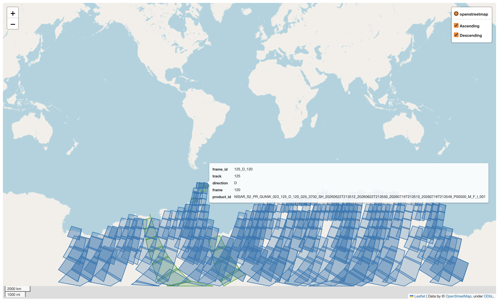

# Programmatic access to Bhoonidhi NISAR S-band data

By the Rignot Research Group with Claude Code assistance




## Antarctica example

Work through the notebook to:

1. Build and plot an up-to-date directory of available S-band frame footprints.
2. Choose frames by track, direction, and frame (for example, `147_A_137`).
3. Download the selected products.

You will need credentials from the [Bhoonidhi website](https://bhoonidhi.nrsc.gov.in/bhoonidhi/login.html).

Set them with:

```bash
export BHOONIDHI_USER='your_user_id'
export BHOONIDHI_PASSWORD='your_password'
```

Or omit these variables and enter your credentials when prompted.
